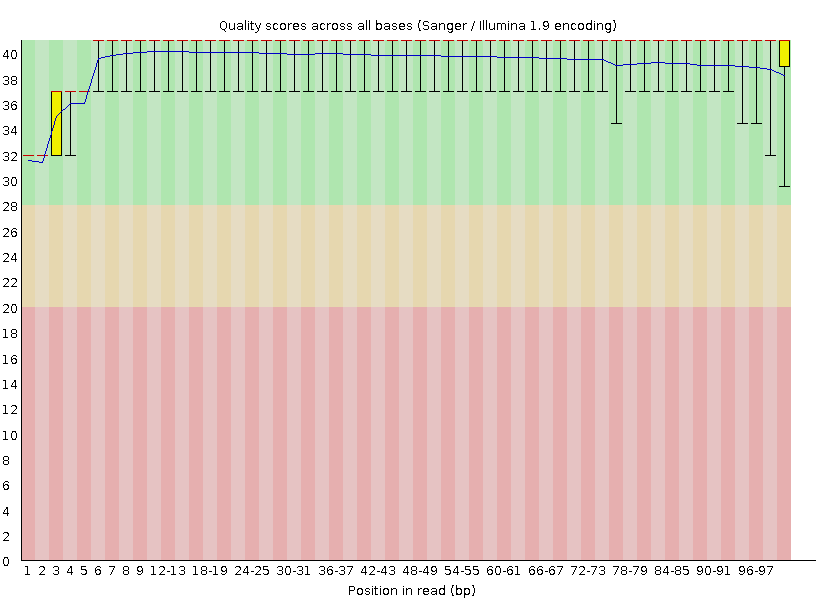
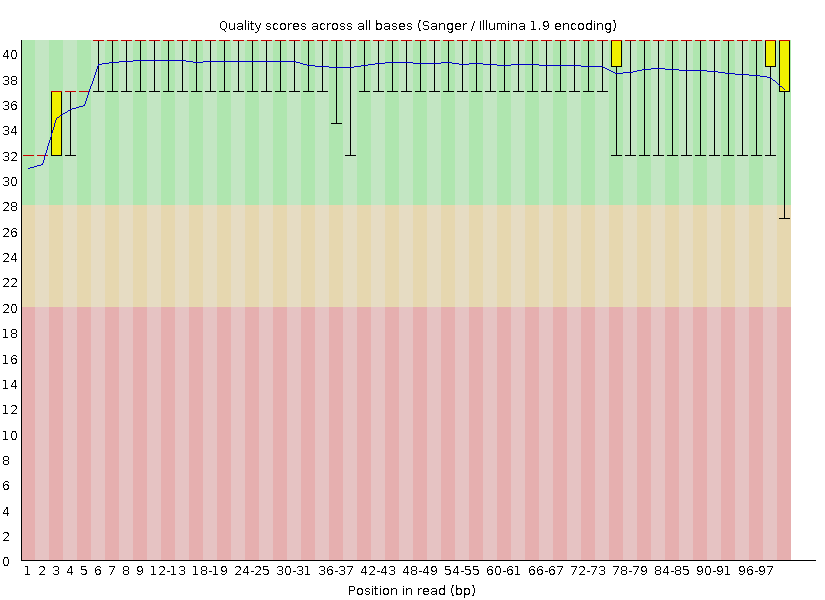
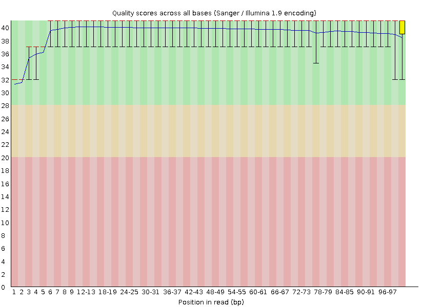
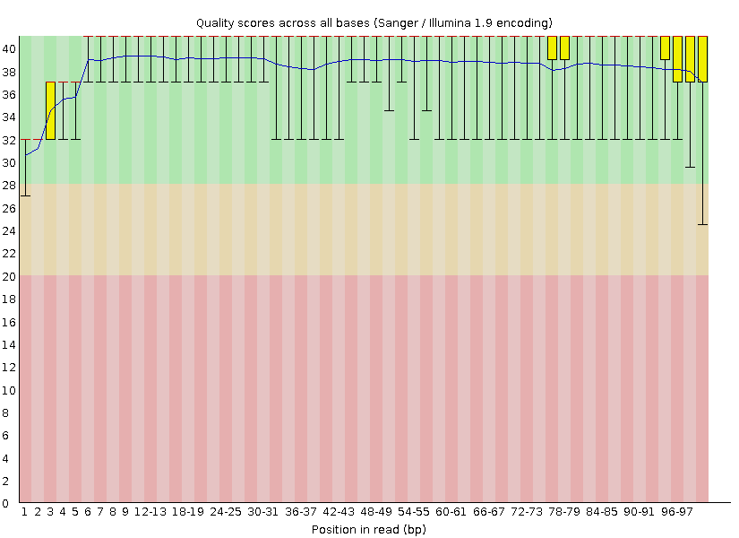
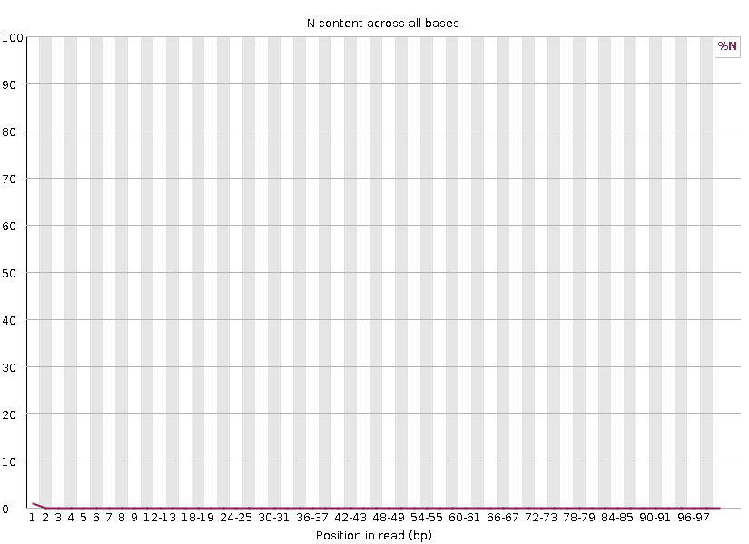
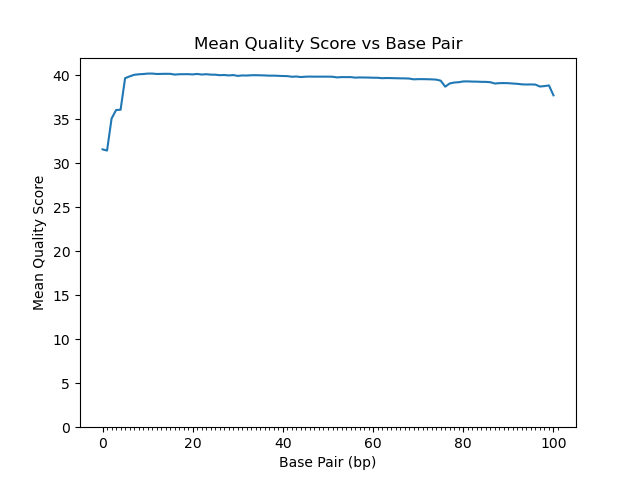
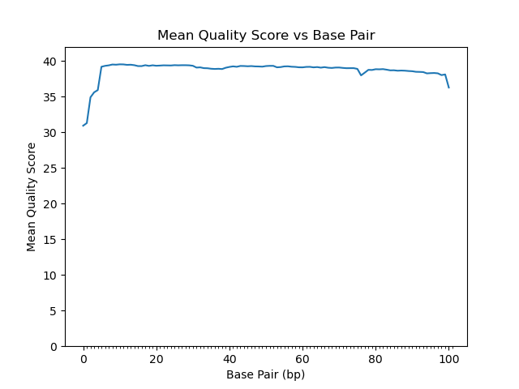
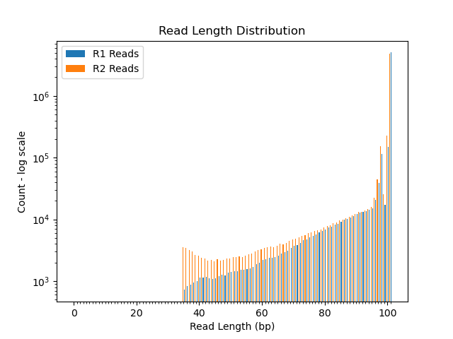
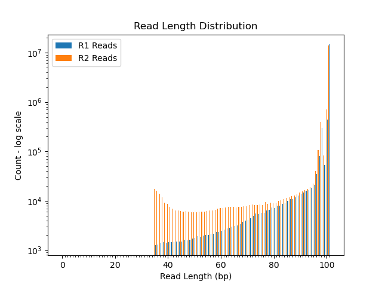

```{r setup, include=FALSE}
```

## Read Quality Score Distributions

### FASTQC per-base quality score distributions:

```{r}
#| echo=FALSE,
#| out.width="49%", 
#| out.height="20%",
#| fig.cap="Per base quality score for RNA-seq samples '2 2B control S2' generated with fastqc.
#| (Left) Average quality score per base with standard deviations for R1 of '2 2B control S2'.
#| (Right) Average quality score per base with standard deviations for R2 of '2 2B control S2'.",
#| fig.show='hold',
#| fig.align='center'


```

```{r}
#| echo=FALSE,
#| out.width="49%", 
#| out.height="20%",
#| fig.cap="Per base quality score for RNA-seq samples '19 3F fox S14' generated with fastqc. 
#| (Left) Average quality score per base with standard deviations for R1 of '19 3F fox S14'. 
#| (Right) Average quality score per base with standard deviations for R2 of '19 3F fox S14'.",
#| fig.show='hold',
#| fig.align='center'


```

\pagebreak

### FASTQC per-base N content:

```{r}
#| echo=FALSE,
#| out.width="49%", 
#| out.height="20%",
#| fig.cap="Per base N content for RNA-seq samples '2 2B control S2' generated with fastqc. 
#| (Left) Counts of N per base for R1 of '2 2B control S2'. 
#| (Right) Counts of N per base for R2 of '2 2B control S2'.",
#| fig.show='hold',
#| fig.align='center'
knitr::include_graphics("fastqc_plots/2_2B_control_S2_L008_R1_001_perbasencontent.png")

```

```{r}
#| echo=FALSE,
#| out.width="49%", 
#| out.height="20%",
#| fig.cap="Per base N content for RNA-seq samples '19 3F fox S14' generated with fastqc. 
#| (Left) Counts of N per base for R1 of '19 3F fox S14'. 
#| (Right) Counts of N per base for R2 of '19 3F fox S14'.",
#| fig.show='hold',
#| fig.align='center'
knitr::include_graphics("fastqc_plots/19_3F_fox_S14_L008_R1_001_perbasencontent.png")
knitr::include_graphics("fastqc_plots/19_3F_fox_S14_L008_R2_001_perbasencontent.png")
```

For both conditions the per base N content is consistent with the per base quality score. Both conditions show more Ns in the beginning of the read correlating to a slight dip in quality in the beginning of the read.

\pagebreak

### Amelia-Written Per-Base Histogram Plots

```{r}
#| echo=FALSE,
#| out.width="49%", 
#| out.height="20%",
#| fig.cap="Per base quality Score for RNA-seq samples '2 2B control S2' generated with personal python script. 
#| (Left) Average quality score per base with no error bars for R1 of '2 2B control S2'. 
#| (Right) Average quality score per base with no error bars for R2 of '2 2B control S2'.",
#| fig.show='hold',
#| fig.align='center'


```

```{r}
#| echo=FALSE,
#| out.width="49%", 
#| out.height="20%",
#| fig.cap="Per base quality Score for RNA-seq samples '19 3F fox S14' generated with personal python script. 
#| (Left) Average quality score per base with no error bars for R1 of '19 3F fox S14'. 
#| (Right) Average quality score per base with no error bars for R2 of '19 3F fox S14'.",
#| fig.show='hold',
#| fig.align='center'

knitr::include_graphics("perbasehist_plots/19_3F_fox_S14_L008_R2_001_perbasehist.png")
```

The overall line of the plots (the means of the scores) is exactly the same, but my plots lack the error bars and color coding. The fastqc plots took 3 minutes and 45 seconds and my histogram script took 10 minutes and 2 seconds. The fastqc plots took less memory (~20 kbytes less) and produced a lot more data! Fastqc is likely much more optimized and written in a language closer to the hardware such as java so it outperforms my script. Essentially, the fastqc plot is faster and prettier, but both methods produce the same data.

The per-base qscore is more than sufficient for these data, and the per-sequence-quality scores are also very high quality. The sequence length distribution is all an even 101 bp. Overall, these data are of very high quality and I feel comfortable moving forward with them.

\pagebreak

## Adapter Trimming Comparisons

The adapter sequences are:

R1: AGATCGGAAGAGCACACGTCTGAACTCCAGTCA

R2: AGATCGGAAGAGCGTCGTGTAGGGAAAGAGTGT

By looking through all the reads for the presence of adapter sequences, the R1 adapter is present in abundance in both condition's R1 and not present at all in R2. The R2 adapter is present in both condition's R2 and not present at all in R1. This makes sense!

```{r}
#| echo=FALSE,
#| out.width="80%", 
#| out.height="80%",
#| fig.cap="Read length distribution for R1 and R2 of RNA-seq sample '2 2B control S2' post-adapter trimming.",
#| fig.show='hold',
#| fig.align='center'

```

```{r}
#| echo=FALSE,
#| out.width="80%", 
#| out.height="80%",
#| fig.cap="Read Length Distribution for R1 and R2 of RNA-seq samples '19 3F fox S14' post-adapter trimming.",
#| fig.show='hold',
#| fig.align='center'

```

For the '2 2B control S2' sample, 7.3% of reads (423,128) were trimmed from R1 and 8.1% of reads (473,368) were trimmed from R2. For the '19 3F fox S14' sample, 3.3% of reads (546,623) were trimmed from R1 and 4.1% of reads (676,564) were trimmed from R2. In both conditions, all reads passed filters and were written.

Adapter was trimmed at a similar rate in both sets with R2 being trimmed slightly more extensively.

These plots agree that R1 is trimmed more extensively than R2 as R1 reads are shorter than R2.

\pagebreak

## Alignment and Strand-Specificity

```{r echo=FALSE, paged.print=TRUE}
ControlReads <- data.frame (
  Mapped=200241,
  Unmapped=11388657)

FoxReads <- data.frame (
  Mapped=732750,
  Unmapped=31963176
)


knitr::kable(ControlReads, caption = "Table 1. Aligned '2 2B control S2' reads that map or do not map to reference mouse genome.", align = "c")
knitr::kable(FoxReads, caption = "Table 2. Aligned '19 3F fox S14' reads that map or do not map to reference mouse genome.", align = "c")
```


Demonstrate convincingly whether or not the data are from "strand-specific" RNA-Seq libraries. Include any comands/scripts used. Briefly describe your evidence, using quantitative statements (e.g. "I propose that these data are/are not strand-specific, because X% of the reads are y, as opposed to z.").


