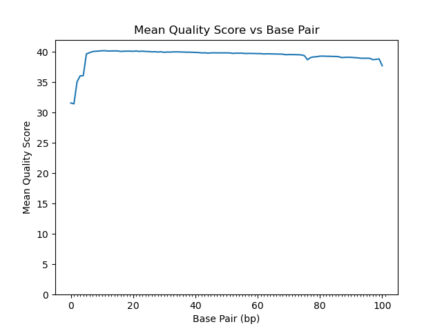
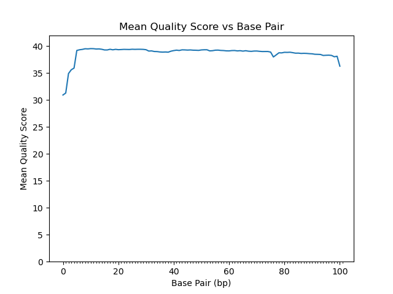

```{r setup, include=FALSE}
knitr::opts_chunk$set(include = FALSE)
library(insight)
```

## Read Quality Score Distributions

### FASTQC per-base quality score distributions:
2_2B_control_S2_L008:
 

19_3F_fox_S14_L008:
 

### FASTQC per-base N content:
2_2B_control_S2_L008:
 

19_3F_fox_S14_L008:
 

### Amelia-Written Per-Base Histogram Plots
2_2B_control_S2_L008:
 

19_3F_fox_S14_L008:
 

## Adapter Trimming Comparisons
2_2B_control_S2_L008:


19_3F_fox_S14_L008:


## Alignment and Strand-Specificity

```{r paged.print=TRUE}
ControlReads <- data.frame (
  Mapped=200241,
  Unmapped=11388657)

FoxReads <- data.frame (
  Mapped=732750,
  Unmapped=31963176
)

# print tables prettily somehow...
```


